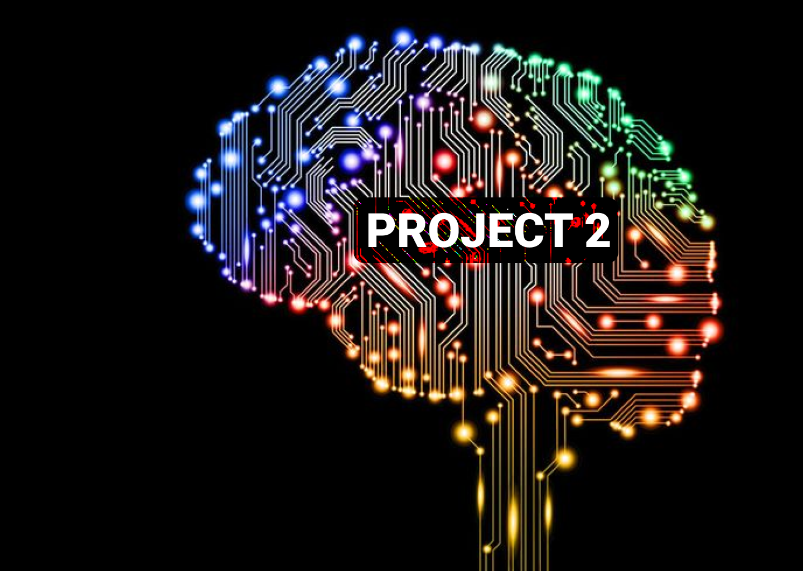

# Project 2
---

## Background

The advancement in financial technology has opened many path towards automation in the financial industry whether it is in the banking, digital payment, or individual and enterprise trading systems. Nowadays, trading strategies are crafted all over the globe by anyone who are willing to take risk and trade in the market.

Inspired by the previous traders, we have created an algorithm trading machine which relies on 3 different indicators: Sentiment Analysis, Technical Analysis, and Candlestick Pattern Recognition System. The three indicators are fed through Recurrent Neuron Network to predict the next trading period whether we should buy or sell the selected stocks.

We have selected Apple, Microsoft, Amazon, Facebook, and Tesla stocks to test our trading strategy and conduct profitability analysis for an actual implementation of the strategy.

| Selected Companies |
| ------------------ |
|  |

For the technical analysis, we used Alpaca API to request the historic stock data to calculate moving averages and the financial ratios. For sentiment analysis, we used the News API to request 620 headlines for at least a month old per company to analyze a compounded sentiment of each company stocks.

### Files

[Integrated Notebook](Integrated.ipynb) - Main file for this project contains code for Candlestick patterns, Technical Analysis signals and Machine Learning models. 

[News_API Notebook](News_API/news_api.ipynb) - Generate sentiment data to use in Integrated Notebook. This file create sentiment data csv files and place them in Sentiment_data folder.
